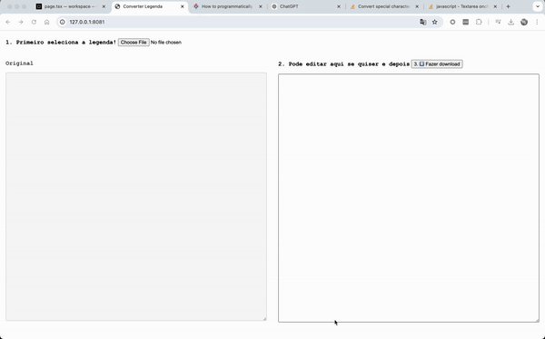

# Limpa legenda

🌍 https://legenda.pages.dev/

Limpa legenda permite fazer o upload de um arquivo `.srt` e transforma ele com as seguintes regras:

- Transforma em letra minúscula a primeira letra de cada frase;
- Remove o ponto final de todas as frases
- Transforma a palavra "IA" em letra minúscula porque em geral se refere ao pretérito do verbo **ir** e não a Inteligencia Artificial (IA)
- Troca todos os números por texto. Eg: 3 => três

Após a transformação é possível editar o arquivo final e fazer download;

